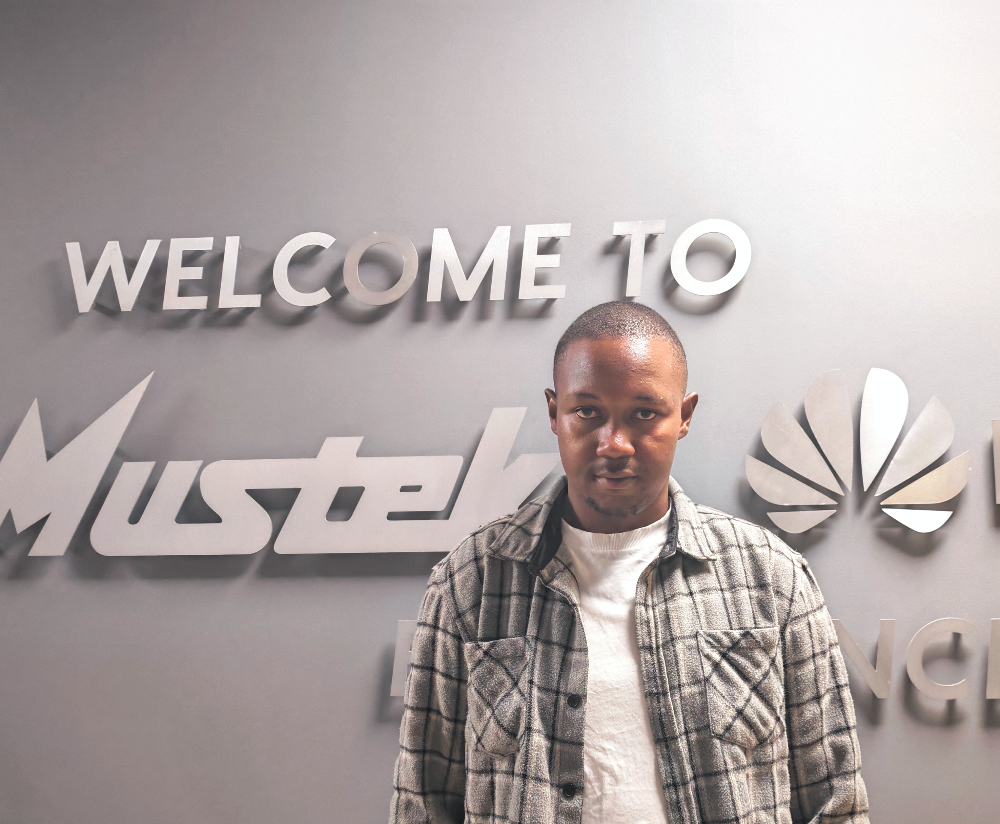

<!-- Header Section -->

# 👋 Hi, I'm Goitseone Rakgomo  
### Software Engineer | AI/ML Engineer | Computer Science Graduate  

Passionate about building **secure, scalable, and user-centric software** with a focus on **health-tech, cloud computing, and community-driven systems**.  
I'm currently exploring the intersection of **AI and healthcare** to develop impactful, innovative solutions.  

## 🔧 Technologies & Tools

  
  
  
  
  
  
  
  
  
  
  
  
  
  
  
  
  
  
  

## 🧠 ML / AI / Data Analytics

  <!-- Matplotlib -->
  
  
  <!-- TensorFlow -->
  
  
  <!-- Keras -->
  
  
  <!-- NumPy -->
  
  
  <!-- Pandas -->
  
  
  <!-- Scikit-learn -->
  

<!-- Optional: Contribution Graph -->

## 📫 Let's Connect  

*"Building technology that matters — one line of code at a time."* ✨

